<h1 align="center">SynapSeq</h1>

<p align="center">
<p align="center">

</p>
  <p align="center">
  <a href="https://github.com/synapseq-foundation/synapseq/releases/latest"></a>
  <a href="COPYING.txt"></a>
  <a href="https://github.com/synapseq-foundation/synapseq/commits"></a>
</p>
</p>

<p align="center"><strong>Text-Driven Audio Sequencer for Brainwave Entrainment</strong></p>

**SynapSeq** is a text-driven audio sequencer for building clear, repeatable brainwave and ambient sessions using a simple domain-specific language, written as SynapSeq sequences (.spsq).

Visit [synapseq.org](https://synapseq.org) for more information.

## What It Looks Like

A basic `.spsq` sequence is plain text: define options, declare presets with indented tracks, then place presets on a timeline.

```spsq
# Options
@samplerate 44100
@volume 80

# Presets
focus
  tone 220 binaural 10 amplitude 25
  noise pink smooth 15 amplitude 12

# Timeline
00:00:00 silence
00:00:15 focus
00:04:30 focus 
00:05:00 silence
```

See [SYNTAX](docs/SYNTAX.md) for the complete language reference.

## Quick Start

The recommended way to install SynapSeq is through the platform package manager.

### Homebrew (macOS & Linux)

Install with [Homebrew](https://brew.sh):

```bash
brew tap synapseq-foundation/synapseq
brew install synapseq
```

### Winget (Windows)

Install with [Winget](https://learn.microsoft.com/en-us/windows/package-manager/winget/):

```powershell
winget update
winget install synapseq
```

After installation, you can run `synapseq -install-file-association` to associate `.spsq` files with SynapSeq and enable additional Explorer context menu actions.

### Manual Downloads

If you prefer to install manually, download the appropriate archive from the latest GitHub release: [4.40.00](https://github.com/synapseq-foundation/synapseq/releases/tag/v4.40.00-foundation).

If you want to build SynapSeq from source, see the [Compilation Guide](docs/COMPILE.md).

### Usage

After installation on any platform, read the repository docs in this order:

- [SYNTAX](docs/SYNTAX.md)
- [HOW IT WORKS](docs/HOW_IT_WORKS.md)

## Programmatic API
Example:
```go
package main

import (
	"fmt"
	"os"
	"time"

	synapseq "github.com/synapseq-foundation/synapseq/v4/core"
	"github.com/synapseq-foundation/synapseq/v4/spsq"
)

func main() {
	// Create a new app context with colorized verbose logging
	ctx := synapseq.NewAppContext().WithVerbose(os.Stderr, true)
	// Create a new spsq builder with a sample rate of 44100 Hz and volume of 80%
	builder := spsq.New().SampleRate(44100).Volume(80)

	// Create a new preset for focus mode
	focus := builder.NewPreset("focus")
	// Add tone with 220 Hz, binaural with 10 Hz, and amplitude of 25%
	focus.Tone(220).Binaural(10).Amplitude(25)
	// Add pink noise with 15% of smoothness and amplitude of 12%
	focus.PinkNoise(15).Amplitude(12)

	// Create the timeline
	timeline := builder.
		// Fade in 00:00:00
		SilenceAt(0).
		// Focus preset starts at 00:00:15
		PresetAt(15*time.Second, focus).
		// Focus preset ends at 00:04:30
		PresetAt(4*time.Minute+30*time.Second, focus).
		// Fade out at 00:05:00
		SilenceAt(5 * time.Minute)

	// Load the sequence into memory
	loaded, err := timeline.Load(ctx)
	if err != nil {
		panic(err)
	}

	// Print the spsq sequence
	fmt.Println(string(loaded.RawContent()))

	// Save the sequence as a WAV file
	if err := loaded.WAV("output.wav"); err != nil {
		panic(err)
	}
}
```

Docs:
- [core](https://pkg.go.dev/github.com/synapseq-foundation/synapseq/v4/core)
- [spsq](https://pkg.go.dev/github.com/synapseq-foundation/synapseq/v4/spsq)

## Contributing

We welcome contributions!

Please read the [CONTRIBUTING](CONTRIBUTING.md) file for guidelines on how to contribute code, bug fixes, and documentation to the project.

## License

SynapSeq is distributed under the GPL v3 or later license. See the [COPYING](COPYING.txt) file for details.

### Third-Party Licenses

All original code in SynapSeq is licensed under the GNU GPL v3 or later, but the following components are included and redistributed under their respective terms:

- **[fatih/color](https://github.com/fatih/color)**  
  License: MIT  
  Used for colorized terminal output.

- **[beep](https://github.com/gopxl/beep)**  
  License: MIT  
  Used for audio encoding/decoding.

- **[golang.org/x/sys](https://pkg.go.dev/golang.org/x/sys)**  
  License: BSD 3-Clause  
  Used for platform-specific system integration.

- **[go-colorable](https://github.com/mattn/go-colorable)**  
  License: MIT  
  Used indirectly for cross-platform ANSI color support.

- **[go-isatty](https://github.com/mattn/go-isatty)**  
  License: MIT  
  Used indirectly for terminal capability detection.

- **[pkg/errors](https://github.com/pkg/errors)**  
  License: BSD 2-Clause  
  Used indirectly for error wrapping and stack trace utilities.

All third-party copyright notices and licenses are preserved in this repository in compliance with their original terms.

## Contact

We'd love to hear from you! Here's how to get in touch:

### Issues (Bug Reports & Feature Requests)

Use [GitHub Issues](https://github.com/synapseq-foundation/synapseq/issues) for:

- Bug reports and technical problems
- Feature requests and enhancement suggestions
- Documentation improvements

### Discussions (Questions & Community)

Use [GitHub Discussions](https://github.com/synapseq-foundation/synapseq/discussions) for:

- General questions and support (e.g., "How do I use `@extends`?")
- Help with your sequences (e.g., "My sequence isn't working, can you help?")
- Sharing your own sequences and presets with the community
- Discussing ideas and best practices
- Showcasing creative use cases

### Quick Guidelines

- **Found a bug?** → Open an Issue
- **Want a new feature?** → Open an Issue
- **Need help or have questions?** → Start a Discussion
- **Want to share your sequences?** → Post in Discussions
- **General feedback or ideas?** → Start a Discussion

## Credits

Check out the [CREDITS](CREDITS.md) to see a list of all contributors and special thanks!
