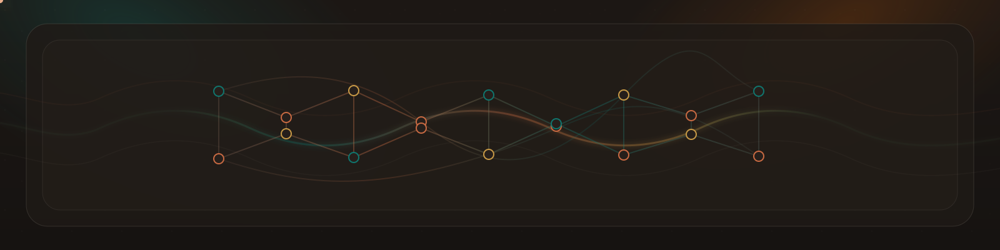

<h1 align="center">SynapSeq</h1>

<p align="center">
  <a href="https://github.com/synapseq-foundation/synapseq/releases/latest"></a>
  <a href="COPYING.txt"></a>
  <a href="https://github.com/synapseq-foundation/synapseq/commits"></a>
</p>
<p align="center">
  <a href="https://skills.sh/synapseq-foundation/synapseq/create-spsq"></a>
  <a href="https://skills.sh/synapseq-foundation/synapseq/explain-spsq"></a>
  <a href="https://skills.sh/synapseq-foundation/synapseq/review-spsq"></a>
</p>
<p align="center">

</p>

<p align="center">
  <a href="#quick-start"><strong>Quick Start</strong></a>
  &nbsp;&middot;&nbsp;
  <a href="#convert-sbagen-sequences">SBaGen</a>
  &nbsp;&middot;&nbsp;
  <a href="#synapseq-remote">Remote</a>
  &nbsp;&middot;&nbsp;
   <a href="#programmatic-api">Go API</a>
   &nbsp;&middot;&nbsp;
   <a href="#generate-spsq-with-ai">AI Generation</a>
   &nbsp;&middot;&nbsp;
   <a href="#use-spsq-with-ai-agents">AI Agents</a>
  &nbsp;&middot;&nbsp;
  <a href="docs/SYNTAX.md">Syntax</a>
</p>

**SynapSeq** turns plain-text sequences into evolving audio. Its small domain-specific language lets you combine tones, binaural, monaural, and isochronic rhythms, noise, music, ambiance, effects, and transitions on a precise timeline.

Sequences are stored as readable `.spsq` files, making them easy to inspect, reproduce, share, and keep under version control. You can render them from the command line or build them programmatically with the Go API.

## Why SynapSeq?

Most audio tools represent a session as a visual project file. SynapSeq approaches it as a written score: presets describe **what plays**, while the timeline describes **how the sound changes**.

This makes SynapSeq useful for:

- sound designers and musicians exploring procedural soundscapes;
- creators building sessions for meditation, relaxation, focus, or sleep routines;
- developers integrating deterministic audio generation into Go applications;
- researchers, students, and audio enthusiasts who need experiments to be documented and repeatable;
- communities that want to exchange compact, human-readable audio recipes instead of large project files.

SynapSeq is best understood as a **creative and experimental audio tool**. It gives you precise control over sound generation, but it does not prescribe what a sequence should be used for or promise a particular effect on the listener.

> [!IMPORTANT]
> SynapSeq is not a medical device and is not intended to diagnose, treat, cure, or prevent any condition. Terms such as *brainwave entrainment*, *focus*, *sleep*, and *relaxation* describe common creative or experimental uses, not guaranteed health or cognitive outcomes. Listen at a comfortable volume and use appropriate care when creating or evaluating sessions.

## What You Can Create

- stereo binaural, monaural, and isochronic tone sequences;
- layered noise, music, and ambient soundscapes;
- gradual or stepped changes in pitch, rhythm, amplitude, and other parameters;
- spatial movement and modulation through effects;
- repeatable sessions rendered as WAV, streamed as PCM, played directly, or converted to MP3;
- reusable presets and sequences extended from other `.spsc` files.

## What It Looks Like

A basic `.spsq` sequence is plain text: define options, declare presets with indented tracks, then place presets on a timeline.

```spsq
# Options
@samplerate 44100
@volume 80

# Presets
focus
  tone 220 binaural 12 amplitude 25
  noise pink smooth 15 amplitude 12

# Timeline
00:00:00 silence
00:00:15 focus
00:04:30 focus 
00:05:00 silence
```

See [SYNTAX](docs/SYNTAX.md) for the complete language reference.

Save the example as `focus.spsq`, then render it:

```bash
synapseq focus.spsq
```

The result is a repeatable audio session generated from the text definition. See [HOW IT WORKS](docs/HOW_IT_WORKS.md) for a perceptual explanation of the tone methods, transitions, and effects.

## Quick Start

The recommended way to install SynapSeq is through the platform package manager.

### Homebrew (macOS & Linux)

Install with [Homebrew](https://brew.sh):

```bash
brew tap synapseq-foundation/synapseq
brew trust synapseq-foundation/synapseq # For homebrew >= 6.x
brew install synapseq
```

### Winget (Windows)

Install with [Winget](https://learn.microsoft.com/en-us/windows/package-manager/winget):

```powershell
winget update
winget install ffmpeg
winget install synapseq
```

After installation, you can run `synapseq -install-file-association` to associate `.spsq` files with SynapSeq.

### Manual Downloads

If you prefer to install manually, download the appropriate archive from the latest GitHub release: [4.41.0](https://github.com/synapseq-foundation/synapseq/releases/tag/v4.41.0).

If you want to build SynapSeq from source, see the [Compilation Guide](docs/COMPILE.md).

### Next Steps

After installation on any platform, read the repository docs in this order:

- [SYNTAX](docs/SYNTAX.md)
- [HOW IT WORKS](docs/HOW_IT_WORKS.md)

## Convert SBaGen Sequences

Starting with SynapSeq 4.41.0, you can convert classic [SBaGen](http://uazu.net/sbagen/) `.sbg` sequences into `.spsq` files:

```bash
synapseq -sbg session.sbg
synapseq -sbg session.sbg converted.spsq
synapseq -sbg session.sbg - > converted.spsq
```

When the output is omitted, SynapSeq writes a `.spsq` file alongside the source using the same name. Use `-` to send the converted SPSQ content to standard output.

> [!WARNING]
> SBaGen conversion is experimental. More complex sequences can produce differences or conversion errors because SBaGen and SynapSeq do not have identical sound sources, transition behavior, or media support. Review and validate the generated `.spsq` before using it.

For a Go example using the `sbg` library, see [Programmatic API](#programmatic-api).

## Generate SPSQ With AI

Use `-ai` to generate a validated `.spsq` sequence from a natural-language prompt through an OpenAI-compatible API:

```bash
export SYNAPSEQ_AI_API_KEY="your-api-key"
synapseq -ai "Generate a 10 minute relaxation sequence"
```

When no output path is given, SynapSeq creates a descriptive new `.spsq` file in the current directory. Supply a path to choose the destination, or `-` to write only SPSQ content to standard output:

```bash
synapseq -ai "Generate a 30 minute study sequence" study-30m.spsq
synapseq -ai "Generate a 20 minute meditation sequence" -
```

SynapSeq requires `SYNAPSEQ_AI_API_KEY` and validates every model response before writing it. Invalid or unrecognized responses return an error and never create an output file. Existing destination files are not overwritten.

Use an OpenAI-compatible local or remote model with environment variables:

```bash
export SYNAPSEQ_AI_API_KEY="local-key"
export SYNAPSEQ_AI_MODEL="google/gemma-4-e4b"
export SYNAPSEQ_AI_BASE_URL="http://localhost:1234"
export SYNAPSEQ_AI_TEMPERATURE="0.2"
export SYNAPSEQ_AI_TIMEOUT="90s"
synapseq -ai "Generate a 15 minute focus sequence"
```

### Windows Environment Variables

In PowerShell, set the variables for the current session before invoking SynapSeq:

```powershell
$env:SYNAPSEQ_AI_API_KEY = "your-api-key"
$env:SYNAPSEQ_AI_MODEL = "gpt-4.1-mini"
synapseq -ai "Generate a 15 minute focus sequence"
```

In Command Prompt, use `set` instead:

```bat
set SYNAPSEQ_AI_API_KEY=your-api-key
set SYNAPSEQ_AI_MODEL=gpt-4.1-mini
synapseq -ai "Generate a 15 minute focus sequence"
```

`SYNAPSEQ_AI_MODEL`, `SYNAPSEQ_AI_BASE_URL`, `SYNAPSEQ_AI_TEMPERATURE`, and `SYNAPSEQ_AI_TIMEOUT` are optional. The default model is `gpt-4.1-mini`, the default API host is OpenAI, CLI temperature is `1`, and requests time out after five minutes. Use `-ai-model MODEL`, `-ai-base-url URL`, `-ai-temperature VALUE`, and `-ai-timeout DURATION` to override their environment-variable values for one command.

SynapSeq validates every response and automatically asks the model to repair invalid SPSQ up to two times. Press `Ctrl+C` to cancel a pending request.

For English prompts containing `delta`, `theta`, `alpha`, `beta`, `gamma`, `sleep`, `meditation`, `focus`, or `relaxation`, SynapSeq also validates the generated beat ranges, audible carriers, and required profile progression before writing the sequence. These checks are sound-design constraints and do not promise a listener outcome.

To generate SPSQ through the public Go API, see [AI Generation From Go](#ai-generation-from-go).

## Use SPSQ With AI Agents

SynapSeq publishes three complementary [skills](https://skills.sh/synapseq-foundation/synapseq) for AI coding agents:

| Skill | Use it to | Result | Existing files |
|-------|-----------|--------|----------------|
| [`create-spsq`](https://skills.sh/synapseq-foundation/synapseq/create-spsq) | Create a sequence from scratch or derive a new version from a reference | A new validated `.spsq` file | Never modified or overwritten |
| [`explain-spsq`](https://skills.sh/synapseq-foundation/synapseq/explain-spsq) | Learn SPSQ syntax or understand how an existing sequence behaves | A didactic, read-only explanation | Never modified |
| [`review-spsq`](https://skills.sh/synapseq-foundation/synapseq/review-spsq) | Audit syntax, semantics, sound structure, and timeline composition | A read-only report with prioritized findings | Never modified |

Choose by the main action: **create**, **explain**, or **review**. The skills can hand work to one another through self-contained prompts, but only `create-spsq` writes complete sequence files, always at a new path.

### Install

Install all SynapSeq skills with the [`skills` CLI](https://github.com/vercel-labs/skills):

```bash
npx skills add synapseq-foundation/synapseq
```

The command installs the complete skill suite and lets you choose the target agent and installation scope.

### Codex

Mention the skill explicitly according to the task:

```text
$create-spsq Create a 20-minute relaxation sequence with a smooth binaural fade-in and fade-out.
$explain-spsq Explain the presets, tracks, and timeline in focus.spsq.
$review-spsq Audit focus.spsq and report technical, structural, and artistic findings.
```

You can also describe the task normally; Codex may select the skill automatically when the request matches its description.

### Claude Code

Invoke the installed skill as a slash command:

```text
/create-spsq Create a 20-minute relaxation sequence with a smooth binaural fade-in and fade-out.
/explain-spsq Explain the presets, tracks, and timeline in focus.spsq.
/review-spsq Audit focus.spsq and report technical, structural, and artistic findings.
```

Claude Code can also load a skill automatically when a request matches its description. Explicit invocation is the most predictable option for both agents. Install SynapSeq using the [Quick Start](#quick-start) instructions when the agent needs to validate a local file with `synapseq -test`.

## SynapSeq Remote

SynapSeq Remote provides ready-to-use sequences. Sync the local index before
listing, searching, downloading, or generating a remote sequence:

```bash
synapseq -sync
```

To sync a self-hosted catalog, pass its base URL. Custom catalogs serve their
index at `/index.json`, unlike the official catalog's `/free/index.json`:

```bash
synapseq -sync-url https://my-sequences.com
```

Set `SYNAPSEQ_REMOTE_BASE_URL` to use that catalog with `-list`, `-search`,
`-info`, `-download`, and `-get` in later commands. Custom URLs must be a root
HTTP(S) URL, without a path, credentials, query, or fragment. SynapSeq stores
each custom catalog in its own cache directory and validates the catalog JSON
and every downloaded SPSQ file before use.

List all available sequences:

```bash
synapseq -list
```

Search sequences by a word found in their name, description, or category:

```bash
synapseq -search focus
```

Use the sequence ID shown by `-list` or `-search` to download its `.spsq` file.
This is the recommended option when you want to keep and inspect the sequence
on your machine:

```bash
synapseq -download calm-state
```

The file is saved as `calm-state.spsq` in the current directory. You can
also provide a destination directory:

```bash
synapseq -download calm-state ./sequences
```

To download a remote sequence and generate its audio in one step, use `-get`:

```bash
synapseq -get calm-state
```

By default, the output uses the sequence name and the `.wav` extension. An
output file can be specified explicitly:

```bash
synapseq -get calm-state calm-state.wav
```

You can export to mp3 using the `-mp3` flag:

```bash
synapseq -mp3 -get calm-state calm-state.mp3
```

Or with `.mp3` extension:

```bash
synapseq -get calm-state calm-state.mp3
```

## Programmatic API

The public Go API can construct the same `.spsq` representation in code and pass it through the regular loading, validation, and rendering pipeline:

### AI Generation From Go

`AppContext.AI` generates and validates SPSQ through an OpenAI-compatible API. Set `SYNAPSEQ_AI_API_KEY` before calling it; `AIOptions` can select a local model, API host, or timeout:

```go
package main

import (
	"context"
	"log"
	"os"
	"time"

	synapseq "github.com/synapseq-foundation/synapseq/v4/core"
)

func main() {
	ctx := synapseq.NewAppContext()
	loaded, err := ctx.AI(context.Background(), "Generate a 10 minute relaxation sequence", &synapseq.AIOptions{
		Model:   "local-model",
		BaseURL: "http://localhost:1234",
		Temperature: 1,
		Timeout: 90 * time.Second,
	})
	if err != nil {
		log.Fatal(err)
	}

	if err := os.WriteFile("relaxation.spsq", loaded.RawContent(), 0o644); err != nil {
		log.Fatal(err)
	}
}
```

Set `AIOptions.Temperature` and `AIOptions.Timeout` for the calling application; `SYNAPSEQ_AI_TEMPERATURE` and `SYNAPSEQ_AI_TIMEOUT` are resolved only by the CLI. Omit `Model` or `BaseURL` to use `SYNAPSEQ_AI_MODEL`, `SYNAPSEQ_AI_BASE_URL`, and the default OpenAI configuration. Pass your own `context.Context` to `AppContext.AI` when the calling program needs cancellation. The returned `LoadedContext` is already validated and can also be rendered directly with `loaded.WAV`.

### SPSQ Builder

Use the builder API to construct an SPSQ sequence programmatically:

```go
package main

import (
	"fmt"
	"os"
	"time"

	synapseq "github.com/synapseq-foundation/synapseq/v4/core"
	"github.com/synapseq-foundation/synapseq/v4/spsq"
)

func main() {
	// Create a new app context with colorized verbose logging
	ctx := synapseq.NewAppContext().WithVerbose(os.Stderr, true)
	// Create a new spsq builder with a sample rate of 44100 Hz and volume of 80%
	builder, err := spsq.New(ctx)
	if err != nil {
		panic(err)
	}
	builder.SampleRate(44100).Volume(80)

	// Create a new preset for focus mode
	focus := builder.NewPreset("focus")
	// Add tone with 220 Hz, binaural with 12 Hz, and amplitude of 25%
	focus.Tone(220).Binaural(12).Amplitude(25)
	// Add pink noise with 15% of smoothness and amplitude of 12%
	focus.Pink(15).Amplitude(12)

	// Create the timeline
	timeline := builder.
		// Fade in 00:00:00
		SilenceAt(0).
		// Focus preset starts at 00:00:15
		PresetAt(15*time.Second, focus).
		// Focus preset ends at 00:04:30
		PresetAt(4*time.Minute+30*time.Second, focus).
		// Fade out at 00:05:00
		SilenceAt(5 * time.Minute)

	// Load the sequence into memory
	loaded, err := timeline.Load()
	if err != nil {
		panic(err)
	}

	// Print the spsq sequence
	fmt.Println(string(loaded.RawContent()))

	// Save the sequence as a WAV file
	if err := loaded.WAV("output.wav"); err != nil {
		panic(err)
	}
}
```

### Convert SBaGen Sequences

The `sbg` package provides the same SBaGen conversion flow in Go:

```go
ctx := synapseq.NewAppContext()
converter, err := sbg.New(ctx)
if err != nil {
    panic(err)
}

loaded, err := converter.LoadFile("session.sbg")
if err != nil {
    panic(err)
}

content := loaded.RawContent()
```

Use `converter.LoadContent(sbgContent)` when the SBaGen source text is already available in memory.

Docs:
- [core](https://pkg.go.dev/github.com/synapseq-foundation/synapseq/v4/core)
- [spsq](https://pkg.go.dev/github.com/synapseq-foundation/synapseq/v4/spsq)
- [sbg](https://pkg.go.dev/github.com/synapseq-foundation/synapseq/v4/sbg)

## Contributing

We welcome contributions!

Please read the [CONTRIBUTING](CONTRIBUTING.md) file for guidelines on how to contribute code, bug fixes, and documentation to the project.

## License

SynapSeq is distributed under the GPL v3 or later license. See the [COPYING](COPYING.txt) file for details.

### Third-Party Licenses

All original code in SynapSeq is licensed under the GNU GPL v3 or later, but the following components are included and redistributed under their respective terms:

- **[fatih/color](https://github.com/fatih/color)**  
  License: MIT  
  Used for colorized terminal output.

- **[beep](https://github.com/gopxl/beep)**  
  License: MIT  
  Used for audio encoding/decoding.

- **[golang.org/x/sys](https://pkg.go.dev/golang.org/x/sys)**  
  License: BSD 3-Clause  
  Used for platform-specific system integration.

- **[go-colorable](https://github.com/mattn/go-colorable)**  
  License: MIT  
  Used indirectly for cross-platform ANSI color support.

- **[go-isatty](https://github.com/mattn/go-isatty)**  
  License: MIT  
  Used indirectly for terminal capability detection.

- **[pkg/errors](https://github.com/pkg/errors)**  
  License: BSD 2-Clause  
  Used indirectly for error wrapping and stack trace utilities.

All third-party copyright notices and licenses are preserved in this repository in compliance with their original terms.

## Contact

We'd love to hear from you! Here's how to get in touch:

### Issues (Bug Reports & Feature Requests)

Use [GitHub Issues](https://github.com/synapseq-foundation/synapseq/issues) for:

- Bug reports and technical problems
- Feature requests and enhancement suggestions
- Documentation improvements

### Discussions (Questions & Community)

Use [GitHub Discussions](https://github.com/synapseq-foundation/synapseq/discussions) for:

- General questions and support (e.g., "How do I use `@extends`?")
- Help with your sequences (e.g., "My sequence isn't working, can you help?")
- Sharing your own sequences and presets with the community
- Discussing ideas and best practices
- Showcasing creative use cases

### Quick Guidelines

- **Found a bug?** → Open an Issue
- **Want a new feature?** → Open an Issue
- **Need help or have questions?** → Start a Discussion
- **Want to share your sequences?** → Post in Discussions
- **General feedback or ideas?** → Start a Discussion

## Credits

Check out the [CREDITS](CREDITS.md) to see a list of all contributors and special thanks!
