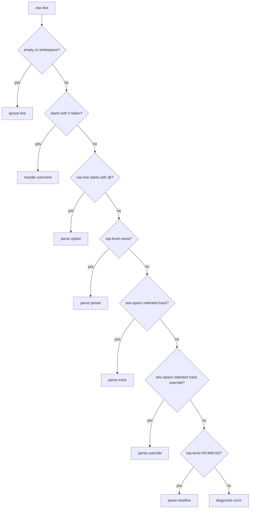

# SynapSeq Syntax

This document describes the `.spsq` sequence format, how the parser classifies lines, and which semantic rules are enforced by the sequence builder after parsing.

It complements [ARCHITECTURE.md](ARCHITECTURE.md), which focuses on package boundaries, runtime flow, and code-level responsibilities.

## Quick Reference

This table is meant to answer the most common question quickly: what kind of line am I allowed to write here?

| Line kind      | Shape                                   | Indentation        | Scope                      | Notes                                                                  |
| -------------- | --------------------------------------- | ------------------ | -------------------------- | ---------------------------------------------------------------------- |
| Comment        | `# ...` or `## ...`                     | any                | anywhere                   | `##` comments are also stored in sequence metadata                     |
| Option         | `@samplerate ...`                       | top-level          | before presets or timeline | options lock after the first preset, track, override, or timeline line |
| Preset         | `alpha`                                 | top-level          | before timeline            | may also use `from` or `as template`                                   |
| Track          | `tone ...`, `noise ...`, `ambiance ...` | exactly two spaces | under the current preset   | not allowed on presets created with `from`                             |
| Track override | `track 1 amplitude 35`                  | exactly two spaces | under an inherited preset  | only valid on non-template presets created with `from`                 |
| Timeline       | `00:00:20 alpha smooth 5`               | top-level          | after presets              | first entry must be `00:00:00`                                         |

Use this as a quick orientation tool. The sections below describe the exact syntax and the builder rules behind each line type.

## The `.spsq` Format

SynapSeq sequence files are line-oriented text documents. The parser does not implement a general-purpose grammar with nested blocks or quoted string handling. Instead, it classifies each line by leading token and indentation, then the sequence builder enforces placement and semantic rules.

At a practical level, a normal `.spsq` file is divided into four phases:

1. top-level options;
2. preset declarations;
3. indented track declarations or track overrides under presets;
4. top-level timeline entries.

The file can also contain comments and blank lines anywhere.

## Line Classification Order

Each non-empty line is evaluated in this order:

1. comment;
2. option;
3. preset declaration;
4. track declaration;
5. track override declaration;
6. timeline declaration;
7. invalid syntax.

That order matters. For example, track lines are only recognized when they are indented with exactly two leading spaces. Timeline lines are only recognized at top level and only when their first token parses as `HH:MM:SS`.



## Tokenization Rules

The parser tokenizes by whitespace.

- there is no quoted-string syntax;
- tokens keep their raw textual form until converted by a specific parser rule;
- spans are tracked for each token so diagnostics can point to exact columns.

Numeric parsing is intentionally strict:

- floats reject `NaN` and `Inf`;
- floats reject scientific notation such as `1e10`;
- integer parsing is strict and used in places such as timeline steps and track override indexes.

## Comments

There are two comment behaviors:

- lines beginning with `#` are parser comments and are ignored structurally;
- lines beginning with `##` are also captured as sequence comments and later exposed through `LoadedContext.Comments()`.

That distinction is important because not every comment in a file becomes user-visible metadata.

## Options

Options are top-level lines that begin with `@`.

The currently supported `.spsq` options are:

- `@samplerate <value>`
- `@volume <value>`
- `@ambiance <name> <path-or-url>`
- `@ambiance <name>` as shorthand, where the path defaults to the same name
- `@extends <path-or-url>`

Options must appear before presets or timeline entries. Once the builder has seen a preset, track, override, or timeline line, options are locked.

Local option paths are normalized and validated before use:

- remote URLs are allowed;
- local paths must use `/`, not `\`;
- local paths must be relative;
- absolute paths and Windows drive paths are rejected;
- parent directory traversal such as `..` is rejected;
- local paths must not include file extensions;
- local ambiance paths resolve to `.wav`;
- local extends paths resolve to `.spsc`.

## Presets

A top-level non-indented identifier line is treated as a preset declaration.

Supported forms are:

```text
alpha
base-focus as template
focus-strong from base-focus
```

Rules:

- preset names must pass name validation;
- duplicate preset names are rejected;
- presets must appear before any timeline entries;
- a preset can inherit only from another preset marked `as template`;
- template presets cannot be used directly in the timeline.

The builder inserts a built-in `silence` preset up front, which is why user-defined presets begin after that implicit baseline.

## Track Declarations

Tracks must be indented with exactly two leading spaces under the current preset.

Examples:

```text
alpha
  noise pink amplitude 30
  tone 200 binaural 10 amplitude 15
  waveform square tone 300 isochronic 10 amplitude 8
  ambiance rain amplitude 25
```

Supported track families are:

- `tone`
- `noise`
- `ambiance`

Tone lines can describe:

- pure tones;
- binaural beats;
- monaural beats;
- isochronic beats;
- optional waveform selection via a leading `waveform` token;
- optional effects followed by `intensity` and then `amplitude`.

Noise lines can describe white, pink, or brown noise, optionally with `smooth`, optional effects, and then `amplitude`.

Ambiance lines reference a named ambiance option and then define amplitude, with optional supported effects. The current parser also accepts a leading `waveform` token before ambiance declarations, even though waveform selection is primarily a tone-oriented concept.

Track declarations are rejected when:

- they appear before any preset;
- they appear after timeline entries have started;
- they are attached to a preset that uses `from`, because inherited presets cannot define new tracks.

## Track Overrides

Track overrides also use two-space indentation, but start with the `track` keyword.

Example:

```text
focus-strong from base-focus
  track 1 amplitude 35
```

Overrides are allowed only when all of the following are true:

- the current preset exists;
- the current preset inherits from another preset with `from`;
- the current preset is not itself a template;
- the override appears before timeline entries.

The parser accepts override kinds such as:

- `tone`
- `binaural`
- `monaural`
- `isochronic`
- `waveform`
- `pan`
- `modulation`
- `doppler`
- `smooth`
- `amplitude`
- `intensity`

Numeric overrides may be absolute or relative. Relative overrides are recognized by a leading `+` or `-` in the raw token.

## Timeline Entries

Timeline lines are top-level and start with an `HH:MM:SS` timestamp.

Format:

```text
00:00:00 silence
00:00:20 alpha steady 5
00:02:00 beta smooth 5
```

Supported transition values are:

- `steady`
- `ease-in`
- `ease-out`
- `smooth`

Rules:

- the first timeline entry must start at `00:00:00`;
- time fields must use exactly two digits each;
- hours must be `00` to `23`;
- minutes and seconds must be `00` to `59`;
- timeline entries must reference an existing non-template preset;
- each new timeline entry must be strictly later than the previous one;
- at least two periods must exist in the final sequence.

When a timeline line includes a transition, an optional integer step count may follow. Step counts must be non-negative.

## Structural Placement Rules

The builder applies additional rules after the parser recognizes a line:

- options must stay at the top of the file;
- presets must be declared before any timeline entries;
- tracks and overrides must belong to the most recently declared preset;
- a file with no user presets is invalid;
- an empty preset is invalid;
- a file with fewer than two timeline periods is invalid.

This is why a file can be syntactically parseable line by line and still fail final sequence construction.

## `.spsc` Extends Files

`@extends` targets `.spsc` files, not `.spsq` files.

Those files are parsed through the same line parser but with a different builder mode:

- they may define options and presets;
- they may define tracks and track overrides under presets;
- they may not define timeline entries;
- they may not use `@extends` themselves.

The purpose of `.spsc` is to contribute reusable options, templates, and presets into a main `.spsq` sequence.

## Minimal Mental Model

The easiest way to read a `.spsq` file is:

1. read top-level `@` options;
2. read preset headers;
3. read two-space indented track content under each preset;
4. read top-level time entries that arrange presets into playback periods.

That mental model matches both the parser and the sequence builder.

## Valid and Invalid Examples

The examples below are intentionally short. They are meant to show common success and failure cases that come directly from the current parser and builder behavior.

### Valid Minimal Sequence

```text
alpha
  tone 100 binaural 1 amplitude 1

00:00:00 alpha
00:01:00 alpha
```

Why it is valid:

- it defines a preset before using it in the timeline;
- the track is indented with exactly two spaces;
- the first period starts at `00:00:00`;
- there are at least two timeline periods.

### Valid Sequence With Stored Comments

```text
## Session intro

alpha
  tone 100 binaural 1 amplitude 1

## Main phase
00:00:00 alpha
00:01:00 alpha
```

Why it is valid:

- the `##` lines are accepted as comments;
- those `##` lines are also persisted and exposed through `LoadedContext.Comments()`.

### Valid Sequence With Extends

```text
@extends presets/base

00:00:00 preparation
00:01:00 preparation
```

Why it is valid:

- `@extends` is a top-level option;
- the local path omits the file extension, so it resolves to `.spsc`;
- the referenced preset can be supplied by the extended file.

### Valid Inherited Preset With Override

```text
base-focus as template
  tone 240 binaural 16 amplitude 15

focus-strong from base-focus
  track 1 amplitude 35

00:00:00 focus-strong
00:01:00 focus-strong
```

Why it is valid:

- `base-focus` is declared as a template;
- `focus-strong` inherits from that template;
- the derived preset uses a track override instead of declaring a new track.

### Invalid: Wrong Indentation For Track Content

```text
alpha
tone 100 binaural 1 amplitude 1

00:00:00 alpha
00:01:00 alpha
```

Why it is invalid:

- the track line is top-level instead of being indented with exactly two spaces;
- this triggers the builder error about expected two-space indentation under a preset definition.

### Invalid: Option After Preset Content Started

```text
alpha
  tone 100 binaural 1 amplitude 1
@volume 80

00:00:00 alpha
00:01:00 alpha
```

Why it is invalid:

- options are only allowed at the top of the file;
- once preset content has started, options are locked.

### Invalid: Duplicate Preset

```text
alpha
alpha
```

Why it is invalid:

- preset names must be unique;
- duplicate preset definitions are rejected during sequence construction.

### Invalid: Timeline Before Any Preset

```text
00:00:00 alpha
00:01:00 alpha
```

Why it is invalid:

- the timeline references presets before any user preset has been declared;
- timeline entries must come after preset declarations.

### Invalid: First Timeline Does Not Start At Zero

```text
alpha
  tone 100 binaural 1 amplitude 1

00:00:10 alpha
00:01:00 alpha
```

Why it is invalid:

- the first timeline entry must begin at `00:00:00`.

### Invalid: Only One Timeline Period

```text
alpha
  tone 100 binaural 1 amplitude 1

00:00:00 alpha
```

Why it is invalid:

- the final sequence must contain at least two periods.

### Invalid: Empty Preset

```text
alpha

00:00:00 alpha
00:01:00 alpha
```

Why it is invalid:

- presets must contain at least one track or inherited track structure;
- empty presets are rejected during final validation.

### Invalid: New Track Under An Inherited Preset

```text
base-focus as template
  tone 240 binaural 16 amplitude 15

focus-strong from base-focus
  tone 260 binaural 18 amplitude 20

00:00:00 focus-strong
00:01:00 focus-strong
```

Why it is invalid:

- presets created with `from` cannot define new tracks;
- they must modify inherited tracks through `track` overrides.

### Invalid: Template Used Directly In Timeline

```text
base-focus as template
  tone 240 binaural 16 amplitude 15

00:00:00 base-focus
00:01:00 base-focus
```

Why it is invalid:

- template presets are reusable building blocks, not playable timeline presets.

### Invalid: Relative Path Traversal In Option

```text
@extends ../shared/base

alpha
  tone 100 binaural 1 amplitude 1

00:00:00 alpha
00:01:00 alpha
```

Why it is invalid:

- local option paths may not traverse parent directories with `..`.

## Informal Grammar

This is a lightweight, line-oriented grammar intended to summarize the parser shape. It is not a full formal specification of every semantic validation rule.

```text
file                 = { line } ;

line                 = blank-line
                     | comment-line
                     | option-line
                     | preset-line
                     | track-line
                     | track-override-line
                     | timeline-line ;

blank-line           = whitespace-only ;

comment-line         = [indent] "#" text
                     | [indent] "##" text ;

option-line          = "@samplerate" integer
                     | "@volume" integer
                     | "@ambiance" name [path-or-url]
                     | "@extends" path-or-url ;

preset-line          = name
                     | name "from" name
                     | name "as" "template" ;

track-line           = indent2 tone-track
                     | indent2 noise-track
                     | indent2 ambiance-track ;

tone-track           = [waveform-prefix] "tone" float tone-tail ;
tone-tail            = "amplitude" float
                     | beat-kind float "amplitude" float
                     | "effect" tone-effect float "intensity" float "amplitude" float
                     | beat-kind float "effect" tone-effect float "intensity" float "amplitude" float ;

noise-track          = "noise" noise-kind noise-tail ;
noise-tail           = "amplitude" float
                     | "smooth" float "amplitude" float
                     | "effect" noise-effect float "intensity" float "amplitude" float
                     | "smooth" float "effect" noise-effect float "intensity" float "amplitude" float ;

ambiance-track       = [waveform-prefix] "ambiance" name ambiance-tail ;
ambiance-tail        = "amplitude" float
                     | "effect" ambiance-effect float "intensity" float "amplitude" float ;

waveform-prefix      = "waveform" waveform ;
waveform             = "sine" | "square" | "triangle" | "sawtooth" ;
beat-kind            = "binaural" | "monaural" | "isochronic" ;
noise-kind           = "white" | "pink" | "brown" ;
tone-effect          = "pan" | "modulation" | "doppler" ;
noise-effect         = "pan" | "modulation" ;
ambiance-effect      = "pan" | "modulation" ;

track-override-line  = indent2 "track" track-index override-kind override-value ;
track-index          = integer ;
override-kind        = "tone"
                     | "binaural"
                     | "monaural"
                     | "isochronic"
                     | "waveform"
                     | "pan"
                     | "modulation"
                     | "doppler"
                     | "smooth"
                     | "amplitude"
                     | "intensity" ;
override-value       = signed-float | waveform ;

timeline-line        = time name [transition [steps]] ;
time                 = HH ":" MM ":" SS ;
transition           = "steady" | "ease-in" | "ease-out" | "smooth" ;
steps                = integer ;

indent2              = exactly two leading spaces ;
name                 = validated identifier ;
integer              = strict base-10 integer ;
float                = strict decimal number ;
signed-float         = float with optional leading "+" or "-" ;
path-or-url          = local path without extension | remote URL ;
```

Use the grammar above as a compact map of accepted line shapes. For placement rules, timeline ordering, preset inheritance restrictions, path normalization, and final sequence validation, follow the semantic sections earlier in this document.
