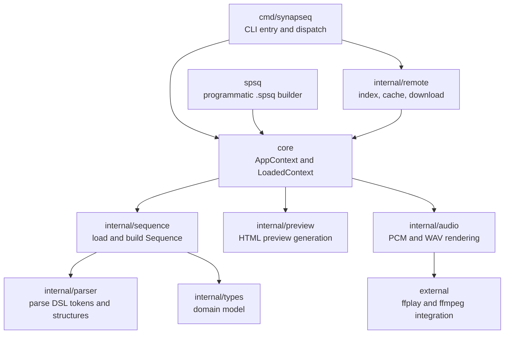
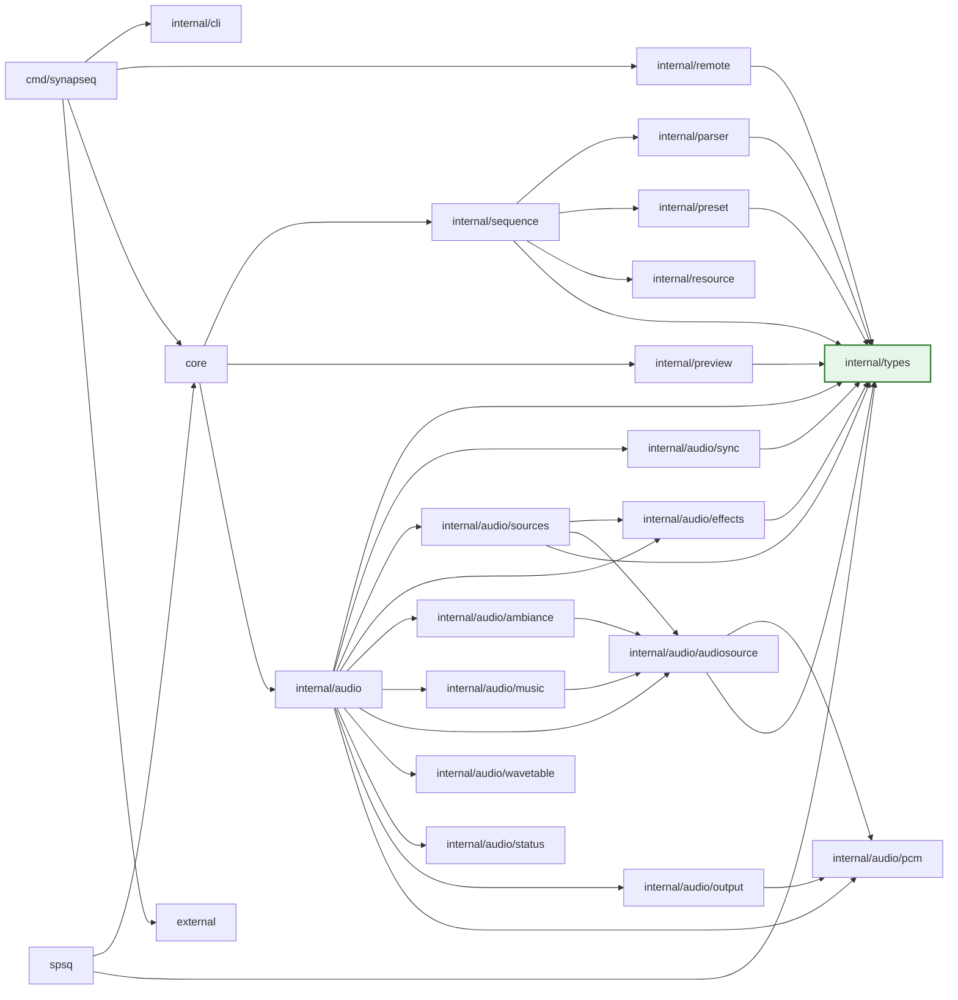
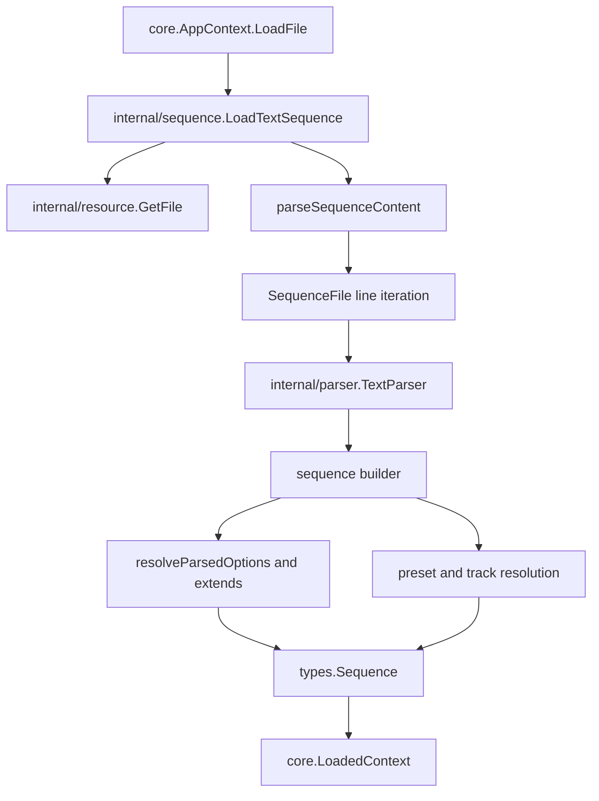
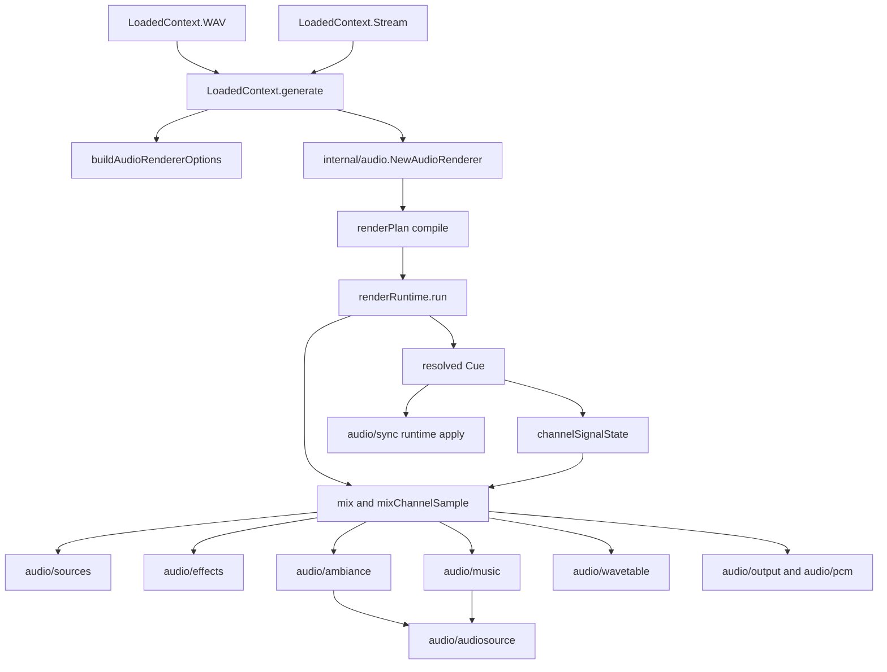
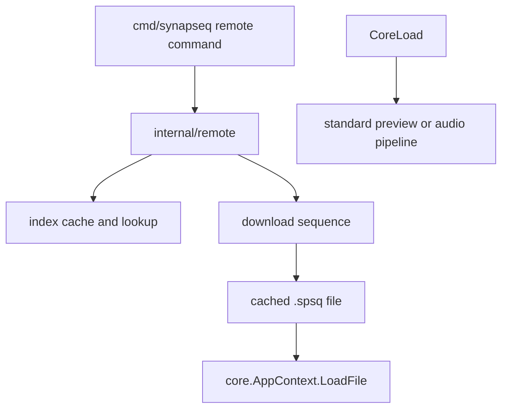

# SynapSeq Architecture

This document explains how SynapSeq is structured today, how data flows through the system, and which architectural boundaries contributors should preserve.

It is written for contributors who need to understand the codebase beyond individual packages. The goal is not to document every function, but to make the major runtime flows and package responsibilities easy to follow.

## Architecture Goals

SynapSeq is organized around a few practical goals:

- keep the public API small and stable;
- keep the text format pipeline explicit and understandable;
- keep the audio renderer modular without turning it into an interface-heavy framework;
- keep package boundaries readable enough that contributors can change one area without guessing how the rest of the system works.

## Guiding Invariants

These invariants are important when changing the codebase:

1. `core` is the public Go API. External consumers should be able to load sequences, inspect metadata, render WAV, stream PCM, and generate previews through `core` without importing internal packages.
2. `cmd/synapseq` is the CLI shell. It parses flags, dispatches commands, and orchestrates output, but it should not absorb parser or renderer logic.
3. `internal/types` must remain a dependency leaf. It defines the domain model and must not import other internal packages.
4. `internal/sequence` owns sequence loading and construction. `internal/parser` parses the DSL, but `internal/sequence` is responsible for turning parsed content into a valid `types.Sequence`.
5. `internal/audio` owns synthesis and rendering. `core` calls it, but does not reimplement audio concerns.
6. `internal/preview` owns HTML preview generation and stays separate from audio rendering.
7. `internal/remote` is an optional source of `.spsq` files. Once a Remote sequence is downloaded, it goes through the same main pipeline as any local sequence.
8. `spsq` is the public programmatic builder API for generating `.spsq` text. It should remain a construction helper that hands generated content to `core.LoadContent` rather than owning parsing, validation, preview, or rendering.

## High-Level Runtime Flow

The main end-to-end runtime looks like this:

There are two main paths:

- a local sequence path, where the CLI loads a user-provided `.spsq` file;
- a Remote path, where the CLI resolves a remote entry first, downloads it, and then reuses the same loading and rendering pipeline.

Programmatic Go callers can also construct `.spsq` content with `spsq.Builder` and load it through `Builder.Load(ctx)`. From that point on, the content uses the same sequence loading, validation, preview, and audio rendering pipeline as hand-written text.

## Package Map

### `cmd/synapseq`

This is the executable entry layer.

- `main.go` handles process startup, flag parsing, and top-level command routing.
- `dispatch.go` executes special commands such as `-version`, `-manual`, `-remote-*`, and `-new`.
- `sequencehandlers.go` handles the standard local sequence flow.
- `output.go` routes loaded sequences to preview, stream, WAV, playback, or MP3 conversion.
- `remote.go` implements CLI-facing Remote commands.

This package should remain a shell around the rest of the system rather than a new home for parser, sequence, or renderer logic.

The `-manual` command is intentionally kept as a discovery shortcut, but it now points users to the canonical repository documents instead of maintaining a second syntax manual inside the binary.

### `core`

This is the public API of SynapSeq.

- `AppContext` carries execution settings such as verbose output.
- `LoadedContext` wraps a loaded sequence and exposes the main operations: `WAV`, `Stream`, `Preview`, and metadata accessors.

The purpose of `core` is to hide internal package wiring behind a small and stable surface.

### `spsq`

This is a public Go API for constructing `.spsq` sequence text programmatically.

- `Builder` records options and timeline entries through fluent method calls.
- `Preset` records tracks and effects for a named preset.
- `Load(ctx)` renders the accumulated builder state as `.spsq` text, validates it through the provided `core.AppContext`, and returns the resulting `LoadedContext`.
- Generated content remains available through `LoadedContext.RawContent()` when callers need the source text.

This package is intentionally a builder, not a parser or renderer. Final sequence loading and validation remain owned by `internal/sequence`, and synthesis remains owned by `internal/audio`.

### `internal/types`

This package defines the domain model used throughout the system.

It includes:

- `Sequence`, `SequenceOptions`, `Period`, `Track`, `Channel`, `Preset`;
- domain enums such as waveform, track type, transition type, and effect type;
- Remote metadata types such as `RemoteEntry` and `RemoteIndex`;
- parser-side option accumulation types such as `ParseOptions`.

This package is intentionally pure and should remain free of dependencies on other internal packages.

### `internal/parser`

This package parses the `.spsq` DSL into structured intermediate data.

It owns lexical and syntactic interpretation of lines such as:

- options;
- presets;
- track declarations;
- track overrides;
- timeline statements;
- comments.

It should parse the language, not own final sequence assembly.

### `internal/sequence`

This package loads text sequences, resolves extends and presets, and builds validated `types.Sequence` values.

It is the bridge between parsing and execution.

### `internal/audio`

This package renders audio from sequence periods and tracks.

The root package owns `AudioRenderer` and the main rendering loop. Supporting responsibilities are split into focused subpackages such as:

- `audio/audiosource` for shared WAV/MP3 external audio mechanics: loading callbacks, decoding, caching, resampling, sample reading, playback mode handling, named-source indexing, and prepared runtime buffers;
- `audio/ambiance` for ambiance-specific policy around external audio: looped playback, ambiance file loading, and source-scoped runtime behavior. WAV is preferred for loopable ambiance; MP3 is supported but may contain codec delay or padding that creates loop gaps;
- `audio/music` for music-specific policy around external audio: finite playback, music file loading, and channel-scoped runtime behavior. Music does not loop automatically and prefers MP3 before WAV during local path resolution;
- `audio/effects` for panning, modulation, doppler, waveform morph, and effect runtime helpers;
- `audio/sources` for compiled source evaluators such as pure tone, binaural, monaural, isochronic, noise, ambiance, and music;
- `audio/sync` for temporal synchronization and per-period updates;
- `audio/wavetable` for waveform lookup tables;
- `audio/output` and `audio/pcm` for output encoding;
- `audio/status` for rendering progress and status output.

Inside the root package, the engine is currently being decomposed into three explicit layers:

- a compiled temporal layer (`renderPlan`) that turns `[]types.Period` into time windows and resolved per-period cues;
- a compiled signal layer (`channelSignalState`) that carries already-resolved waveform, effect, amplitude, and increment data for the active channel state;
- a mutable runtime layer (`types.Channel`) that now trends toward phase, offsets, and smoothing state rather than full semantic ownership of the signal.

This refactor is intentionally incremental. The parser and `.spsq` syntax remain unchanged while the audio engine boundary is being pushed away from `types.Period` and toward explicit compiled artifacts.

### `internal/preview`

This package renders loaded sequences into interactive HTML previews.

It is organized around template/view-model generation, track analysis, time series, graph metrics, and asset embedding. Preview is intentionally separate from audio rendering.

### `internal/remote`

This package manages SynapSeq Remote sequences:

- index loading and sync;
- local cache management;
- entry lookup;
- downloading sequences.

Remote is optional input infrastructure, not part of the renderer itself.

### `internal/cli`

This package contains CLI-oriented infrastructure used by the executable:

- flag definitions and parsing;
- special command resolution;
- help and version output;
- text styling for terminal output.

It is internal because it serves the executable, but it is kept separate from `cmd/synapseq` so the command package remains focused on orchestration.

### Other supporting packages

- `internal/diag` centralizes structured diagnostics and source-aware parse errors.
- `internal/timeline` provides transition math used by rendering and preview.
- `internal/preset` supports preset-related resolution and helpers.
- `internal/resource` abstracts file access and local or remote loading.
- `internal/nameref` centralizes name validation and reference handling.
- `internal/textstyle` supports terminal styling used by CLI-facing output.

## Package Boundaries

The current dependency shape can be summarized like this. It is intentionally simplified rather than exhaustive:

The most important part of this graph is that `internal/types` stays at the bottom as a shared model package.

At the user-flow level, `spsq.Builder.Load(ctx)` validates generated text through the provided `core.AppContext` and returns the resulting loaded context to the caller.

## CLI and Command Dispatch Flow

The CLI pipeline begins in `cmd/synapseq`.

1. `main()` calls `cli.ParseFlags()`.
2. `run()` asks `dispatchSpecialCommand()` to handle special commands first.
3. If no special command matches, `handleSequenceCommand()` handles the standard local sequence flow.
4. `output.go` decides whether the loaded sequence becomes preview HTML, raw PCM, WAV, live playback, or MP3.

This flow intentionally keeps command precedence explicit while centralizing the definition of special commands inside `internal/cli`.

## Sequence Loading, Parsing, and Building

Sequence construction is a multi-step flow.

Important responsibilities:

- `internal/parser` interprets the language.
- `internal/sequence` coordinates line iteration, builders, extends resolution, preset resolution, and final assembly.
- `core` only exposes the final result as `LoadedContext`.

This split is important because it keeps parser logic isolated from construction and validation logic.

The `.spsq` and `.spsc` language rules are documented in [SYNTAX.md](SYNTAX.md). Keep this architecture document focused on package structure and runtime flow; use the syntax document when changing parser behavior, sequence-building rules, or the text format itself.

## Audio Rendering Flow

Audio output is driven from `LoadedContext` methods in `core` and implemented by `internal/audio`.

At a high level:

1. `core` validates that a loaded sequence is renderable.
2. `core` builds renderer options from sequence options and `AppContext` verbosity settings.
3. `internal/audio` constructs an `AudioRenderer` with waveform tables, ambiance/music runtimes, sync engine, and effect processor.
4. The renderer compiles a temporal plan and resolves per-period cues before entering the hot render loop.
5. The render loop applies each cue into mutable channel runtime state and then synthesizes PCM samples through the mix loop.
6. The mixer and effects path consume compiled signal state instead of recomputing semantics directly from `Period` on every chunk.
7. Ambiance and music tracks read prepared external-audio buffers through their policy wrappers, which share the neutral `audio/audiosource` implementation underneath.
8. The output path writes either WAV or raw PCM.

### Current Engine Refactor Direction

The audio engine is in the middle of a controlled rearchitecture. The current direction should be preserved:

1. parser and `.spsq` syntax remain frozen;
2. semantic sequence loading still ends in `types.Sequence` and `types.Period`;
3. `renderPlan` is the first compilation boundary after semantic sequence data;
4. `audio/sync` is being narrowed so it applies resolved cues instead of deciding temporal interpolation;
5. the mixer hot path is being shifted from `types.Channel`-driven semantics to explicit compiled signal artifacts;
6. new source evaluators should be introduced incrementally per signal family, starting with concrete tone sources rather than a big-bang rewrite.

Today, that migration lives in the `internal/audio/sources` subpackage:

- pure tone rendering uses a dedicated `pureToneSource`;
- binaural rendering uses a dedicated `binauralBeatSource`;
- monaural rendering uses a dedicated `monauralBeatSource`;
- isochronic rendering uses a dedicated `isochronicBeatSource`;
- noise rendering uses a dedicated `noiseSource`;
- ambiance and music rendering use the prepared external-audio source path;
- the remaining legacy aspect is not missing source evaluators, but the runtime model itself: these evaluators are still driven by mutable `Channel` state, `Offset`, and `Increment` inside the current renderer loop.

Within `internal/audio/effects`, the supporting effect processor code is also now split by concern rather than concentrated in one file:

- `morph.go` owns waveform morph resolution from channel state;
- `waveform.go` owns waveform lookup and interpolation helpers;
- `doppler.go`, `modulation.go`, and `pan.go` own their respective effect families;
- `apply.go`, `runtime.go`, and `smoothing.go` hold effect dispatch, phase advancement, and smoothing state.

Contributors working in `internal/audio` should prefer continuing this direction over reintroducing semantic or temporal decision-making into `sync`, `mix`, or `effects` hot paths.

The renderer is intentionally concrete. It is not an interface-heavy pipeline; contributors should prefer focused collaborators over generalization.

## Preview Flow

Preview generation is a parallel path to audio rendering.

1. `LoadedContext.Preview()` validates that a sequence is available.
2. `internal/preview.GetPreviewContent()` builds a view model from sequence periods.
3. The preview package uses embedded assets and Go templates to render a complete HTML document.

The preview package was intentionally decomposed into focused modules such as formatting, track analysis, time series, graph metrics, presentation, assets, and view models. That separation should be preserved rather than collapsed back into a large monolithic file.

## Remote Flow

Remote is an optional sequence source, not a separate execution engine.

That means Remote integration should stay shallow:

- find the sequence;
- update or query cache;
- download the `.spsq` file;
- hand the downloaded `.spsq` file back to the normal load pipeline.

Remote should not fork the rendering architecture.

## External Tool Integration

The `external` package is a small adapter layer for ffplay and ffmpeg.

- `FFplay.Play()` pipes raw PCM from a loaded sequence into ffplay.
- `FFmpeg.Convert()` pipes raw PCM into ffmpeg and infers the output format from the output file extension.

This package should remain thin. It wraps process invocation and streaming, not core rendering policy.

## Public API Surface

The public Go API should continue to revolve around the following mental model:

1. Create an `AppContext`.
2. Optionally configure it with `WithVerbose()`.
3. Load an `.spsq` file with `LoadFile()` or `LoadContent()` for string sequence content. If the sequence is constructed programmatically, use `spsq.New()` and `Builder.Load(ctx)` to get a `LoadedContext`.
4. Use the resulting `LoadedContext` to:
   - inspect comments, sample rate, volume, ambiance, extends, and raw content;
   - render WAV;
   - stream raw PCM;
   - render preview HTML.

Contributors should be cautious about expanding the public API. Internal refinements are much cheaper than public API changes.

## Contribution Guidance

When contributing changes, use these heuristics:

1. Preserve the purity of `internal/types`.
2. Keep `core` small and stable.
3. Prefer concrete helpers over abstract interfaces unless there is a real second implementation.
4. Keep `cmd/synapseq` as orchestration, not business logic.
5. If a change affects sequence loading, inspect both `internal/parser` and `internal/sequence` before deciding where the logic belongs.
6. If a change affects output, check whether it belongs to preview, audio, external tools, or only the CLI shell.
7. If a change touches Remote behavior, keep Remote as an input source and cache layer rather than a second execution pipeline.

## Suggested Reading Order

For new contributors, the fastest way to build context is:

1. `cmd/synapseq/main.go`
2. `cmd/synapseq/dispatch.go`
3. `core/context.go`, `core/sequence.go`, `core/generate.go`
4. `internal/sequence/loadtext.go` and `internal/sequence/parsecontent.go`
5. `internal/parser/*`
6. `internal/audio/renderer.go` and `internal/audio/rendercycle.go`
7. `internal/preview/preview.go`
8. `internal/remote/*` if working on remote sequence workflows

That path mirrors how the application itself flows at runtime.
