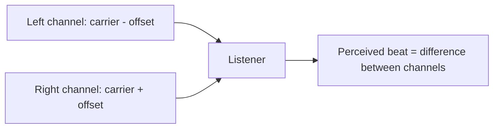
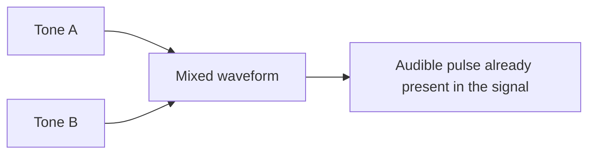
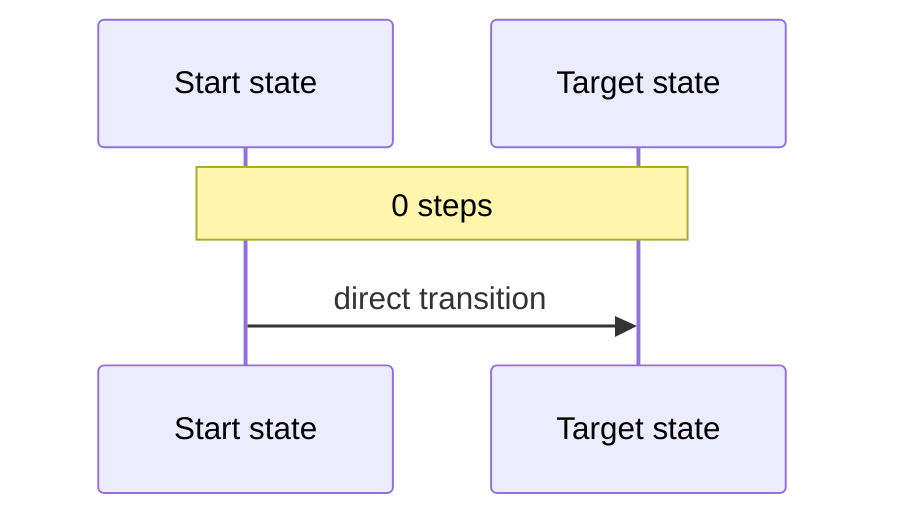
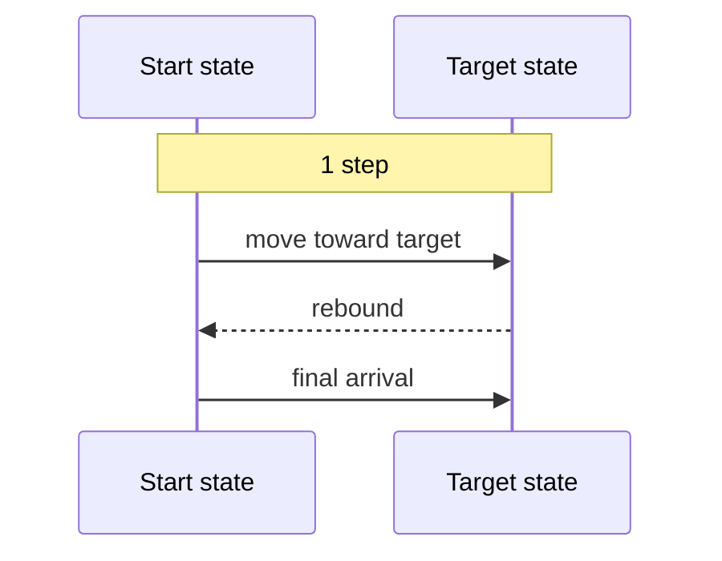
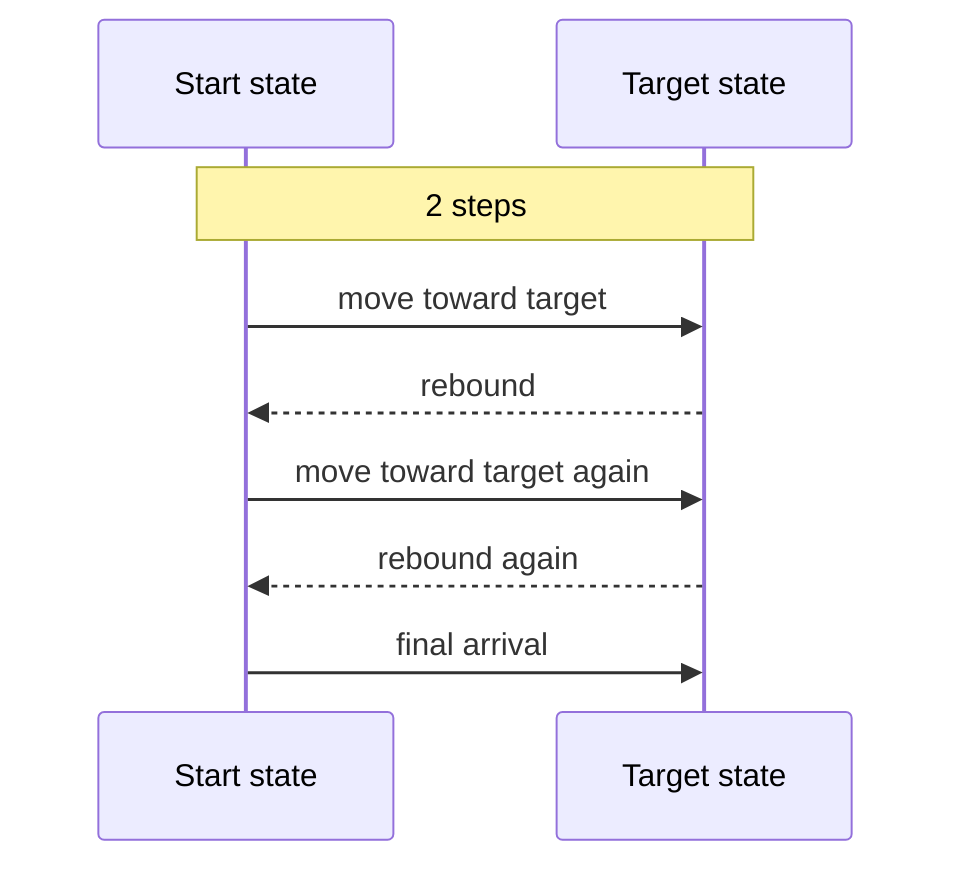
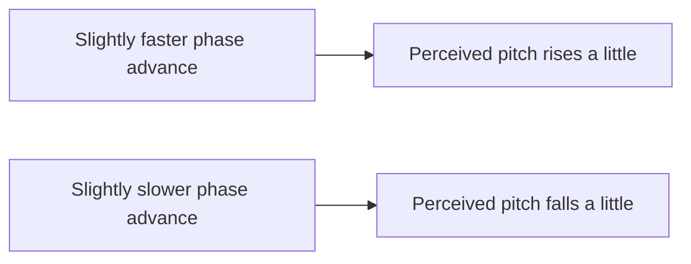

# How SynapSeq Works

This guide explains the main listening concepts behind SynapSeq.

It is written for users who want to understand what the engine is doing in perceptual terms: what kind of sound is being generated, how it moves over time, and how effects shape the stereo image and motion.

It complements [SYNTAX.md](SYNTAX.md). `SYNTAX.md` explains how to write a sequence. This document explains what those features mean when you listen to them.

## The Core Idea

SynapSeq builds a session from two layers of intent:

- what is playing: tones, beat-based tones, noise, and ambiance;
- how it changes: transitions, steps, and effects.

A preset defines a sound state. The timeline defines how one state becomes the next.

That distinction matters. SynapSeq is not only a collection of sounds. It is a sequence of controlled changes between sounds.

## Tone-Based Methods

The three main entrainment-oriented methods in SynapSeq are `binaural`, `monaural`, and `isochronic`.

They may aim at a similar perceived rhythm, but they create it in different ways.

### Binaural Beats

A binaural beat sends one tone to the left ear and a slightly different tone to the right ear.

The beat is not a physical pulse already present in the audio waveform. It is perceived from the difference between the two channels.

```text
Left ear:   ~~~~~ ~~~~~ ~~~~~ ~~~~~
Right ear:  ~~~~~~ ~~~~~~ ~~~~~~ ~~~~

Perception:    <---- slow internal beat ---->
```

Another way to picture it:



In SynapSeq:

- `carrier` is the pitch center you hear;
- `binaural` is the beat difference between left and right.

Binaural beats are typically best suited to headphone listening, because the left and right signals need to stay clearly separated.

### Monaural Beats

A monaural beat starts from nearby frequencies too, but they are combined into the signal before they reach your ears.

That means the pulse exists in the waveform itself. The sound physically rises and falls in amplitude.

```text
Two close tones:
  ~~~~~
   ~~~~~

Combined result:
  ~-~~---~~~~---~~-~~~~---~~
     loud   soft  loud
```

Conceptually:



In SynapSeq:

- `carrier` sets the tonal center;
- `monaural` sets the pulse rate.

Compared with binaural beats, monaural beats usually sound more explicit and more physically pulsed.

### Isochronic Tones

An isochronic tone uses one tone that turns on and off repeatedly.

The rhythm comes from regular gating rather than from the interaction of two close frequencies.

```text
Carrier tone:
  ~~~~~~~~~~~~~~~~~~~~~~~~~~~

Isochronic gating:
  ON    OFF   ON    OFF   ON
  ====  ____  ====  ____  ====

Heard result:
  ~~~~        ~~~~        ~~~~
```

Conceptually:


In SynapSeq:

- `carrier` sets the pitch;
- `isochronic` sets the pulse rate.

Of the three methods, isochronic tones are usually the clearest in terms of pulse definition.

## Comparing The Three Methods

The easiest way to think about them is this:

- `binaural`: two channels differ, and the beat is perceived from that difference;
- `monaural`: two nearby tones are physically combined, creating a pulse in the waveform;
- `isochronic`: one tone is rhythmically switched on and off.

```text
Binaural:   left != right  -> beat emerges from stereo difference
Monaural:   tone + tone    -> beat exists in the mixed signal
Isochronic: tone * gate    -> beat exists as direct pulsing
```

## Transitions

Transitions define the shape of change between one timeline entry and the next.

They are not limited to volume fades. They shape the interpolation across compatible parameters in the period, including amplitude and other evolving values.

If you imagine a transition as a path from `start` to `target`, the transition type controls the curve of that path.

### Transition Shapes

```text
steady
Progress:  0% ----- 25% ----- 50% ----- 75% ----- 100%
           uniform change throughout

ease-in
Progress:  0% -- 10% --- 25% ----- 50% ------- 100%
           gentle start, faster ending

ease-out
Progress:  0% ------- 50% ----- 75% --- 90% -- 100%
           fast start, gentle ending

smooth
Progress:  0% -- 15% ----- 50% ----- 85% -- 100%
           gentle start, active middle, gentle ending
```

Read each line as perceived change over time:

- bigger jumps early mean faster early movement;
- bigger jumps late mean faster late movement;
- evenly spaced jumps mean a constant pace.

So:

- `steady` keeps the same pace throughout;
- `ease-in` begins gently and accelerates later;
- `ease-out` moves early and settles gently near the end;
- `smooth` is gentle at both ends and more active around the middle.

### `steady`

`steady` is the most neutral curve.

It moves at a constant rate from start to end. Nothing is intentionally emphasized at the beginning or the end.

```text
Progress:  0% ----- 25% ----- 50% ----- 75% ----- 100%
Wave:      start -------- constant rate -------- target
```

Use it when you want change to feel controlled, even, and mechanical in the best sense.

### `ease-in`

`ease-in` starts gently and gains momentum later.

Early movement is restrained. Most of the change becomes more noticeable in the second half.

```text
Progress:  0% -- 10% --- 25% ----- 50% ------- 100%
Wave:      start -- gentle -- building ------- faster end
```

Use it when you want the destination to arrive gradually at first rather than announcing itself immediately.

### `ease-out`

`ease-out` does the opposite.

It moves more decisively at the beginning and settles more softly near the end.

```text
Progress:  0% ------- 50% ----- 75% --- 90% -- 100%
Wave:      start ------- fast change ------- soft landing
```

Use it when you want the listener to notice the shift early, but not feel a hard landing.

### `smooth`

`smooth` is the most organic curve of the four.

It eases in, becomes more active around the middle, and eases out again before finishing.

```text
Progress:  0% -- 15% ----- 50% ----- 85% -- 100%
Wave:      start -- ease in ---- full motion ---- ease out
```

Use it when you want the transition to feel rounded rather than linear.

## Steps

Steps add internal structure to a transition.

Without steps, the path goes from start to target in one continuous direction. With steps, the path alternates before finally arriving at the target.

That means `steps` do not simply chop time into equal blocks. They create a back-and-forth trajectory inside the period.

`0 steps`



---

`1 step`



---

`2 steps`



In listening terms, steps make a transition feel more staged, hypnotic, or wave-like.

In SynapSeq, the number of steps is limited by the duration of the period, so short timeline intervals cannot contain many of them.

## Noise Types

Noise in SynapSeq is not only filler. It can work as texture, masking, atmosphere, or a stabilizing background under tonal material.

SynapSeq supports three main noise colors.

### White Noise

White noise has the brightest and most restless character.

It contains strong high-frequency activity and often feels airy, sharp, or hiss-like.

```text
White noise texture:
_|\/|_/\|\/_/|/\|_\/|/\_/|\/|_
```

### Pink Noise

Pink noise feels more balanced and less sharp than white noise.

It still has a broad texture, but it is usually perceived as fuller and softer.

```text
Pink noise texture:
___/\/\____/\/\____/\/\____/\/\___
```

### Brown Noise

Brown noise is heavier in the low end and usually feels deeper, darker, and more weighted.

Of the three, it is generally the smoothest and least bright.

```text
Brown noise texture:
____/~~~~~\_______/~~~~~\_______/~~~~~\____
```

## Noise Smoothness

Noise can also use `smooth`.

This does not change white noise into pink noise, or pink into brown. The noise color stays the same. What changes is the moment-to-moment roughness of that chosen noise.

```text
Low smooth:
_|\/|_/\|\/_/|/\|_\/|/\_/|\/|_

High smooth:
____/~~~~\________/~~~~\________/~~~~\____
```

In listening terms:

- lower smoothness feels more raw, grainy, and restless;
- higher smoothness feels more rounded, softer, and less jittery.

## Effects

Effects add motion on top of a track.

They do not define the sound source itself. Instead, they shape how that source moves, sways, or breathes during playback.

SynapSeq currently supports three effects:

- `pan`
- `modulation`
- `doppler`

### `pan`

`pan` moves energy across the stereo field.

Instead of changing the pitch, it changes where the sound seems to sit between left and right.

```text
Left <----- center -----> Right

pan motion:
L -----> -----> C -----> -----> R
```

Conceptually:


In listening terms, `pan` makes a sound feel like it is drifting, circling, or sweeping across the headspace.

### `modulation`

`modulation` changes amplitude over time.

It acts like an extra moving gain layer on top of the source, making the track breathe or pulse.

```text
Before modulation:
~~~~~~~~~~~~~~~~~~~~~~~~

After modulation:
~~ ~~~~ ~~  ~~~~ ~~ ~~~
```

Conceptually:

```text
source waveform:      ~~~~~~~~~~~~~~~~~~~
modulation envelope:  __/^^^^\____/^^^^\_
heard result:         ~~ ~~~~ ~~  ~~~~ ~~
```

In listening terms, `modulation` adds rhythmic emphasis without changing the fundamental identity of the source.

### `doppler`

`doppler` creates subtle moving pitch shift behavior.

It does this by varying playback increment over time, which changes the apparent frequency slightly up and down.

```text
Approaching feeling:  waves get tighter
~~~~ ~~~~~ ~~~~~~ ~~~~~~~

Receding feeling:     waves spread out
~~~~~~~ ~~~~~~ ~~~~~ ~~~~
```

Conceptually:



In listening terms, `doppler` adds gentle motion and a sense of passing or orbital drift rather than simple left-right movement.

## Putting It Together

A typical SynapSeq session combines several layers of perception at once:

- a source identity, such as binaural, monaural, isochronic, noise, or ambiance;
- a movement profile, shaped by transitions and optional steps;
- an animation layer, shaped by effects such as `pan`, `modulation`, or `doppler`.

That combination is what gives a sequence its character. Two sessions can use the same beat rate and still feel very different because they move differently, layer noise differently, or animate the stereo field in different ways.

## A Simple Reading Model

When reading a SynapSeq session conceptually, this is usually enough:

1. identify the source: what kind of sound is being generated;
2. identify the motion: how the timeline moves between states;
3. identify the animation: which effects add stereo or rhythmic movement.

That mental model usually tells you more about the listening experience than raw parameter names alone.
