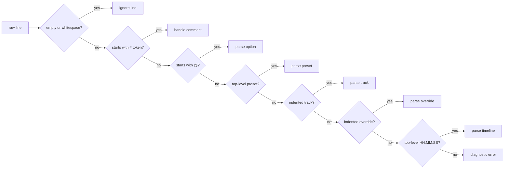

# SynapSeq Syntax

This document describes the `.spsq` sequence format, how the parser classifies lines, and which semantic rules are enforced by the sequence builder after parsing.

It complements [ARCHITECTURE](ARCHITECTURE.md), which focuses on package boundaries, runtime flow, and code-level responsibilities.

## Quick Reference

This table is meant to answer the most common question quickly: what kind of line am I allowed to write here?

| Line kind      | Shape                                   | Indentation        | Scope                      | Notes                                                                  |
| -------------- | --------------------------------------- | ------------------ | -------------------------- | ---------------------------------------------------------------------- |
| Comment        | `# ...` or `## ...`                     | any                | anywhere                   | `##` comments are also stored in sequence metadata                     |
| Option         | `@samplerate ...`                       | top-level          | before presets or timeline | options lock after the first preset, track, override, or timeline line |
| Preset         | `alpha`                                 | top-level          | before timeline            | may also use `from` or `as template`                                   |
| Track          | `[waveform <name>] tone ...`, `noise ...`, `[waveform <name>] ambiance ...`, `[waveform <name>] music ...` | exactly two spaces | under the current preset   | not allowed on presets created with `from`                             |
| Track override | `track 1 amplitude 35`                  | exactly two spaces | under an inherited preset  | only valid on non-template presets created with `from`                 |
| Timeline       | `00:00:20 alpha smooth 5`               | top-level          | after presets              | first entry must be `00:00:00`                                         |

Use this as a quick orientation tool. The sections below describe the exact syntax and the builder rules behind each line type.

## Authoring Rules for Agents

Use these rules before consulting the detailed sections:

- put all options before presets and timeline entries;
- indent every track and track override with exactly two ASCII spaces;
- do not use quoted strings: SPSQ tokenizes on whitespace;
- declare only ambiance and music sources supplied by the user or already present in the sequence and its dependencies;
- use `waveform <name>` explicitly for `tone`, `ambiance`, and `music` tracks when generating or serializing SPSQ; omitted waveform means `sine`;
- end every playable sequence with at least two strictly increasing timeline entries, beginning at `00:00:00`;
- validate generated files with `bin/synapseq -test <file>` or `go run ./cmd/synapseq -test <file>`.

## The `.spsq` Format

SynapSeq sequence files are line-oriented text documents. The parser does not implement a general-purpose grammar with nested blocks or quoted string handling. Instead, it classifies each line by leading token and indentation, then the sequence builder enforces placement and semantic rules.

At a practical level, a normal `.spsq` file is divided into four phases:

1. top-level options;
2. preset declarations;
3. indented track declarations or track overrides under presets;
4. top-level timeline entries.

The file can also contain comments and blank lines anywhere.


## Line Classification Order

Each non-empty line is evaluated in this order:

1. comment;
2. option;
3. preset declaration;
4. track declaration;
5. track override declaration;
6. timeline declaration;
7. invalid syntax.

That order matters. For example, track lines are only recognized when they are indented with exactly two leading spaces. Timeline lines are only recognized at top level and only when their first token parses as `HH:MM:SS`.



## Tokenization Rules

The parser tokenizes by whitespace.

- there is no quoted-string syntax;
- tokens keep their raw textual form until converted by a specific parser rule;
- spans are tracked for each token so diagnostics can point to exact columns.

Numeric parsing is intentionally strict:

- floats reject `NaN` and `Inf`;
- floats reject scientific notation such as `1e10`;
- integer parsing is strict and used in places such as timeline steps and track override indexes.

## Comments

There are two comment behaviors:

- lines beginning with `#` are parser comments and are ignored structurally;
- lines beginning with `##` are also captured as sequence comments and later exposed through `LoadedContext.Comments()`.

That distinction is important because not every comment in a file becomes user-visible metadata.

## Options

Options are top-level lines that begin with `@`.

The currently supported `.spsq` options are:

- `@samplerate <value>`
- `@volume <value>`
- `@ambiance <name> <path-or-url>`
- `@ambiance <name>` as shorthand, where the path defaults to the same name
- `@music <name> <path-or-url>`
- `@music <name>` as shorthand, where the path defaults to the same name
- `@waveform <name> <point1> <point2> ... <pointN>`
- `@transition <name> <point1> <point2> ... <pointN>`
- `@extends <path-or-url>`

Options must appear before presets or timeline entries. Once the builder has seen a preset, track, override, or timeline line, options are locked.

Local option paths are normalized and validated before use:

- remote URLs are allowed;
- local paths must use `/`, not `\`;
- local paths must be relative;
- absolute paths and Windows drive paths are rejected;
- parent directory traversal such as `..` is rejected;
- local paths must not include file extensions;
- local ambiance paths first resolve to `.wav`, then to `.mp3` only when the WAV file is missing;
- WAV is the recommended ambiance format, especially for continuous or seamless loops;
- MP3 is supported as a fallback format, but MP3 encoding can add delay or padding that may create audible gaps when the file loops;
- remote ambiance URLs must identify a WAV or MP3 file by extension, or provide a WAV or MP3 MIME type when the URL has no extension;
- remote resource failures, including non-2xx responses, invalid MIME types, and decode failures, stop rendering with an error;
- local music paths first resolve to `.mp3`, then to `.wav` only when the MP3 file is missing;
- music does not loop automatically, so MP3 is the preferred local fallback order for this use case;
- remote music URLs follow the same WAV/MP3 extension or MIME type rules as ambiance URLs;
- local extends paths resolve to `.spsc`.

### Custom Waveforms

A custom waveform defines one periodic cycle as evenly spaced amplitude points and gives it a reusable name:

```spsq
@waveform softpulse 0 0 20 60 100 60 20 0

focus
  waveform softpulse tone 200 isochronic 10 amplitude 20

00:00:00 focus
00:00:30 focus
```

Rules:

- names follow the normal SPSQ name rules and are case-sensitive when referenced;
- `sine`, `square`, `triangle`, and `sawtooth` are reserved built-in names, including case variants;
- a definition requires between 2 and 16384 points;
- each point is an ordinary decimal from `0` through `100`;
- `0` maps to the internal minimum (`-1`), `50` to the centerline (`0`), and `100` to the maximum (`+1`);
- points are evenly spaced over one cycle and joined with linear interpolation;
- interpolation is circular: the final point connects linearly back to the first;
- duplicate definitions are rejected, including collisions across `.spsq` and extended `.spsc` files;
- custom waveforms may be declared in `.spsc` files and are available to their presets after extension;
- an unknown `waveform <name>` reference is an error.

The four built-ins retain their existing formulas and rendering behavior. Custom waveforms use the same track-level `waveform <name>` syntax and the same runtime wavetable path after name resolution. Sharp corners and steep segments can produce strong harmonics and aliasing; custom tables are not band-limited.

### Custom Transitions

A custom transition defines an evenly spaced interpolation curve for timeline changes:

```spsq
@transition soft-land 0 2 12 42 78 96 100

00:00:00 silence soft-land
00:00:30 focus
```

Rules:

- names follow normal SPSQ name rules, are case-sensitive when referenced, and must not be `steady`, `ease-in`, `ease-out`, or `smooth`, including case variants;
- a definition requires 2 through 256 decimal points from `0` through `100` in non-decreasing order;
- the first point must be `0` and the last `100`;
- definitions must be unique across the `.spsq` and all extended `.spsc` files;
- a timeline transition name must be built-in or have a matching definition.

Points are normalized to `0..1`, evenly distributed over the period, and linearly interpolated between adjacent points. The same curve is reapplied to each forward or backward leg created by `steps`. Custom curves govern compatible interpolation and fades to or from `silence`; automatic crossfades for incompatible channels remain linear.

## Presets

A top-level non-indented identifier line is treated as a preset declaration.

Supported forms are:

```text
alpha
base-focus as template
focus-strong from base-focus
```


Rules:

- preset names must pass name validation;
- duplicate preset names are rejected;
- presets must appear before any timeline entries;
- a preset can inherit only from another preset marked `as template`;
- template presets cannot be used directly in the timeline.

The builder inserts a built-in `silence` preset up front, which is why user-defined presets begin after that implicit baseline.

### Built-in `silence` Preset

The `silence` preset is always available, even if the file never declares it explicitly.

Important properties:

- `silence` is built in by the sequence builder;
- the name `silence` is reserved and cannot be redefined by user presets;
- it behaves like a real preset in the timeline, so it can be referenced anywhere a preset name is expected.

In practice, `silence` is commonly used at the beginning and end of a sequence:

```text
00:00:00 silence
00:00:20 alpha
00:20:00 silence
```

That pattern is useful for two reasons:

- at the beginning, it gives the sequence a silent lead-in before the first active preset;
- at the end, it gives the sequence a silent destination so playback can settle back to zero instead of stopping on an active preset.

When `silence` is adjacent to an active preset, the timeline adjustment logic turns that boundary into a fade-compatible transition by preserving the target track shape while forcing amplitude to or from zero.

That means:

- `silence -> alpha` behaves like a fade-in into the next preset;
- `alpha -> silence` behaves like a fade-out from the current preset.


The actual transition curve still follows the transition configured on the period itself, such as `steady`, `ease-in`, `ease-out`, or `smooth`.

If two consecutive timeline entries use incompatible active track types, effect types, ambiance sources, or music sources on the same channel, SynapSeq applies an automatic boundary crossfade instead of requiring an explicit `silence` bridge.

The automatic crossfade is adaptive. It uses up to 30 seconds before the boundary for fade-out and up to 30 seconds after the boundary for fade-in, clamping each side to the available adjacent period duration when the periods are shorter.

Inactive `off` channels also participate in boundary fades:

- `active -> off` fades the active channel out before the boundary, then leaves the channel disabled;
- `off -> active` keeps the channel disabled before the boundary, then fades the active channel in after the boundary.

The crossfade is applied per channel and does not insert additional timeline periods into the loaded sequence.

## Track Declarations

Tracks must be indented with exactly two leading spaces under the current preset.

Examples:

```text
alpha
  noise pink amplitude 30
  noise white effect modulation 5 intensity 40 amplitude 20
  noise pink effect shift 8 intensity 20 amplitude 20
  tone 200 binaural 10 amplitude 15
  tone 300 effect pan 0.5 intensity 40 amplitude 40
  tone 300 effect shift 10 intensity 25 amplitude 20
  waveform square tone 300 isochronic 10 amplitude 8
  tone 300 binaural 10 effect doppler 0.9 intensity 80 amplitude 40
  waveform sine ambiance rain amplitude 25
  waveform sine ambiance rain effect pan 0.5 intensity 60 amplitude 30
  waveform sine ambiance rain effect doppler 0.8 intensity 40 amplitude 30
  waveform sine ambiance rain effect shift 10 intensity 25 amplitude 30
  waveform sine music meditation amplitude 50
  waveform sine music meditation effect pan 0.5 intensity 60 amplitude 30
  waveform sine music meditation effect doppler 0.8 intensity 40 amplitude 30
  waveform sine music meditation effect shift 8 intensity 20 amplitude 30
  tone 300 binaural 10 amplitude left 10 right 5
  noise pink amplitude left 30 right 25
```

Supported track families are:

- `tone`
- `noise`
- `ambiance`
- `music`

Tone lines can describe:

- pure tones;
- binaural beats;
- monaural beats;
- isochronic beats;
- optional waveform selection via a leading `waveform` token;
- optional effects followed by `intensity` and then `amplitude`.

Noise lines can describe white, pink, or brown noise, optionally with `smooth`, optional effects, and then `amplitude`.

Ambiance lines reference a named ambiance option and then define amplitude, with optional supported effects. A leading `waveform <name>` is valid and controls the shape of waveform-driven effects; omitted waveform means `sine`.

For tones, the selected waveform shapes pure, binaural, and monaural oscillators. On an isochronic track, the same waveform shapes both the carrier and the rhythmic gate. It also shapes waveform-driven `pan`, `modulation`, and `doppler` motion. For ambiance and music, it does not reshape the external PCM; it affects waveform-driven `pan` or `modulation`, while `doppler` uses that waveform to vary PCM playback speed. `shift` always uses sine/cosine quadrature internally and ignores the selected waveform.

Music lines reference a named music option and use the same waveform, amplitude, and effect forms as ambiance. Music is finite: when the file ends, that channel becomes silent and rendering continues until the sequence timeline ends.

`amplitude` accepts either one percentage, `amplitude <value>`, or explicit channels, `amplitude left <value> right <value>`. The one-value form applies to both channels. `left` always requires a following `right` value. Each value must be between `0` and `100`. The gains are applied after effects, so the declared values control the final left and right channel levels.

`doppler` is available on tone, ambiance, and music, but not noise. Its value is the movement rate in Hz and its intensity sets a waveform-shaped playback-speed variation of up to plus or minus 5 percent. On generated tones this changes oscillator phase advance; on ambiance and music it uses stereo fractional playback, preserving the left/right source image. Each external Doppler track has an independent playback cursor and resumes its current position when returning to fixed speed. Ambiance keeps looping while music can end slightly earlier or later than at fixed speed. A waveform prefix shapes Doppler movement on all supported sources; it does not reshape external PCM directly.

`shift` is available on tone, noise, ambiance, and music. Its value is the total frequency separation in Hz: `shift 10` moves the wet left signal up by 5 Hz and the wet right signal down by 5 Hz. The wet signal is derived from `(left + right) / 2`; mono sources naturally supply the same sample to both sides. `intensity 0` or `shift 0` preserves the original signal, while `intensity 100` is the fully shifted mono-derived stereo pair.

On a pure sine tone, fully wet `shift` approaches a pair separated by the declared value. Partial intensity retains the dry carrier as well. On non-sine tones, every harmonic is shifted by the same number of Hz rather than regenerated from a detuned fundamental. Monaural and isochronic tracks shift their complete generated signal. A binaural track retains its original stereo pair only in the dry portion; its wet portion first combines both channels and can contain multiple shifted components. Noise uses the same operation, although frequency-shifted white noise may be perceived mainly as stereo decorrelation rather than a pitch change.

`shift` creates spectral divergence and is not a guarantee of a binaural beat or perceptual response. The FIR Hilbert path has a 31-sample wet latency, is least accurate near DC and Nyquist, and can alias content shifted across the available frequency band. `shift` always uses sine/cosine quadrature internally and does not use the selected track waveform for its oscillator.

Track declarations are rejected when:

- they appear before any preset;
- they appear after timeline entries have started;
- they are attached to a preset that uses `from`, because inherited presets cannot define new tracks.

## Track Overrides

Track overrides also use two-space indentation, but start with the `track` keyword.

Example:

```text
focus-strong from base-focus
  track 1 amplitude 35
```

Overrides are allowed only when all of the following are true:

- the current preset exists;
- the current preset inherits from another preset with `from`;
- the current preset is not itself a template;
- the override appears before timeline entries.

The parser accepts override kinds such as:

- `tone`
- `binaural`
- `monaural`
- `isochronic`
- `waveform`
- `pan`
- `modulation`
- `doppler`
- `shift`
- `smooth`
- `amplitude`
- `intensity`

Numeric overrides may be absolute or relative. Relative overrides are recognized by a leading `+` or `-` in the raw token. `track N amplitude <value>` changes both channels, while `track N left <value>` and `track N right <value>` change one channel independently.

## Timeline Entries

Timeline lines are top-level and start with an `HH:MM:SS` timestamp.

Format:

```text
00:00:00 silence
00:00:20 alpha steady 5
00:02:00 beta smooth 5
```

Supported transition values are:

- `steady`
- `ease-in`
- `ease-out`
- `smooth`

Rules:

- the first timeline entry must start at `00:00:00`;
- time fields must use exactly two digits each;
- hours must be `00` to `23`;
- minutes and seconds must be `00` to `59`;
- timeline entries must reference an existing non-template preset;
- each new timeline entry must be strictly later than the previous one;
- at least two periods must exist in the final sequence.

When a timeline line includes a transition, an optional integer step count may follow. Step counts must be non-negative.

## Structural Placement Rules

The builder applies additional rules after the parser recognizes a line:

- options must stay at the top of the file;
- presets must be declared before any timeline entries;
- tracks and overrides must belong to the most recently declared preset;
- a file with no user presets is invalid;
- an empty preset is invalid;
- a file with fewer than two timeline periods is invalid.

This is why a file can be syntactically parseable line by line and still fail final sequence construction.

## `.spsc` Extends Files

`@extends` targets `.spsc` files, not `.spsq` files.

Those files are parsed through the same line parser but with a different builder mode:

- they may define options, custom waveforms, and presets;
- they may define tracks and track overrides under presets;
- they may not define timeline entries;
- they may not use `@extends` themselves.

The purpose of `.spsc` is to contribute reusable options, waveform definitions, templates, and presets into a main `.spsq` sequence.

## Minimal Mental Model

The easiest way to read a `.spsq` file is:

1. read top-level `@` options;
2. read preset headers;
3. read two-space indented track content under each preset;
4. read top-level time entries that arrange presets into playback periods.

That mental model matches both the parser and the sequence builder.

## Valid and Invalid Examples

The examples below are intentionally short. They are meant to show common success and failure cases that come directly from the current parser and builder behavior.

### Valid Minimal Sequence

```text
alpha
  tone 100 binaural 1 amplitude 1

00:00:00 alpha
00:01:00 alpha
```

Why it is valid:

- it defines a preset before using it in the timeline;
- the track is indented with exactly two spaces;
- the first period starts at `00:00:00`;
- there are at least two timeline periods.

### Valid Sequence With Stored Comments

```text
## Session intro

alpha
  tone 100 binaural 1 amplitude 1

## Main phase
00:00:00 alpha
00:01:00 alpha
```

Why it is valid:

- the `##` lines are accepted as comments;
- those `##` lines are also persisted and exposed through `LoadedContext.Comments()`.

### Valid Sequence With Extends

```text
@extends presets/base

00:00:00 preparation
00:01:00 preparation
```

Why it is valid:

- `@extends` is a top-level option;
- the local path omits the file extension, so it resolves to `.spsc`;
- the referenced preset can be supplied by the extended file.

### Valid Inherited Preset With Override

```text
base-focus as template
  tone 240 binaural 16 amplitude 15

focus-strong from base-focus
  track 1 amplitude 35

00:00:00 focus-strong
00:01:00 focus-strong
```

Why it is valid:

- `base-focus` is declared as a template;
- `focus-strong` inherits from that template;
- the derived preset uses a track override instead of declaring a new track.

### Invalid: Wrong Indentation For Track Content

```text
alpha
tone 100 binaural 1 amplitude 1

00:00:00 alpha
00:01:00 alpha
```

Why it is invalid:

- the track line is top-level instead of being indented with exactly two spaces;
- this triggers the builder error about expected two-space indentation under a preset definition.

### Invalid: Option After Preset Content Started

```text
alpha
  tone 100 binaural 1 amplitude 1
@volume 80

00:00:00 alpha
00:01:00 alpha
```

Why it is invalid:

- options are only allowed at the top of the file;
- once preset content has started, options are locked.

### Invalid: Duplicate Preset

```text
alpha
alpha
```

Why it is invalid:

- preset names must be unique;
- duplicate preset definitions are rejected during sequence construction.

### Invalid: Timeline Before Any Preset

```text
00:00:00 alpha
00:01:00 alpha
```

Why it is invalid:

- the timeline references presets before any user preset has been declared;
- timeline entries must come after preset declarations.

### Invalid: First Timeline Does Not Start At Zero

```text
alpha
  tone 100 binaural 1 amplitude 1

00:00:10 alpha
00:01:00 alpha
```

Why it is invalid:

- the first timeline entry must begin at `00:00:00`.

### Invalid: Only One Timeline Period

```text
alpha
  tone 100 binaural 1 amplitude 1

00:00:00 alpha
```

Why it is invalid:

- the final sequence must contain at least two periods.

### Invalid: Empty Preset

```text
alpha

00:00:00 alpha
00:01:00 alpha
```

Why it is invalid:

- presets must contain at least one track or inherited track structure;
- empty presets are rejected during final validation.

### Invalid: New Track Under An Inherited Preset

```text
base-focus as template
  tone 240 binaural 16 amplitude 15

focus-strong from base-focus
  tone 260 binaural 18 amplitude 20

00:00:00 focus-strong
00:01:00 focus-strong
```

Why it is invalid:

- presets created with `from` cannot define new tracks;
- they must modify inherited tracks through `track` overrides.

### Invalid: Template Used Directly In Timeline

```text
base-focus as template
  tone 240 binaural 16 amplitude 15

00:00:00 base-focus
00:01:00 base-focus
```

Why it is invalid:

- template presets are reusable building blocks, not playable timeline presets.

### Invalid: Relative Path Traversal In Option

```text
@extends ../shared/base

alpha
  tone 100 binaural 1 amplitude 1

00:00:00 alpha
00:01:00 alpha
```

Why it is invalid:

- local option paths may not traverse parent directories with `..`.

## Informal Grammar

This is a lightweight, line-oriented grammar intended to summarize the parser shape. It is not a full formal specification of every semantic validation rule.

```text
file                 = { line } ;

line                 = blank-line
                     | comment-line
                     | option-line
                     | preset-line
                     | track-line
                     | track-override-line
                     | timeline-line ;

blank-line           = whitespace-only ;

comment-line         = [indent] "#" text
                     | [indent] "##" text ;

option-line          = "@samplerate" integer
                     | "@volume" integer
                     | "@ambiance" name [path-or-url]
                     | "@music" name [path-or-url]
                     | "@waveform" name waveform-point waveform-point { waveform-point }
                     | "@transition" name transition-point transition-point { transition-point }
                     | "@extends" path-or-url ;

preset-line          = name
                     | name "from" name
                     | name "as" "template" ;

track-line           = indent2 tone-track
                     | indent2 noise-track
                     | indent2 ambiance-track
                     | indent2 music-track ;

tone-track           = [waveform-prefix] "tone" float tone-tail ;
tone-tail            = "amplitude" amplitude-value
                     | beat-kind float "amplitude" amplitude-value
                     | "effect" tone-effect float "intensity" float "amplitude" amplitude-value
                     | beat-kind float "effect" tone-effect float "intensity" float "amplitude" amplitude-value ;

noise-track          = "noise" noise-kind noise-tail ;
noise-tail           = "amplitude" amplitude-value
                     | "smooth" float "amplitude" amplitude-value
                     | "effect" noise-effect float "intensity" float "amplitude" amplitude-value
                     | "smooth" float "effect" noise-effect float "intensity" float "amplitude" amplitude-value ;

ambiance-track       = [waveform-prefix] "ambiance" name ambiance-tail ;
ambiance-tail        = "amplitude" amplitude-value
                     | "effect" ambiance-effect float "intensity" float "amplitude" amplitude-value ;

music-track          = [waveform-prefix] "music" name music-tail ;
music-tail           = "amplitude" amplitude-value
                     | "effect" music-effect float "intensity" float "amplitude" amplitude-value ;

waveform-prefix      = "waveform" waveform ;
waveform             = name ;
waveform-point       = float ;  (* 0 through 100; 2 through 16384 points *)
transition-point     = float ;  (* non-decreasing 0 through 100; 2 through 256 points; first 0, last 100 *)
amplitude-value      = float | "left" float "right" float ;  (* each 0 through 100 *)
beat-kind            = "binaural" | "monaural" | "isochronic" ;
noise-kind           = "white" | "pink" | "brown" ;
tone-effect          = "pan" | "modulation" | "doppler" | "shift" ;
noise-effect         = "pan" | "modulation" | "shift" ;
ambiance-effect      = "pan" | "modulation" | "doppler" | "shift" ;
music-effect         = "pan" | "modulation" | "doppler" | "shift" ;

track-override-line  = indent2 "track" track-index override-kind override-value ;
track-index          = integer ;
override-kind        = "tone"
                     | "binaural"
                     | "monaural"
                     | "isochronic"
                     | "waveform"
                     | "pan"
                     | "modulation"
                     | "doppler"
                     | "shift"
                     | "smooth"
                     | "amplitude"
                     | "left"
                     | "right"
                      | "intensity" ;
override-value       = signed-float | waveform ;

timeline-line        = time name [transition [steps]] ;
time                 = HH ":" MM ":" SS ;
transition           = builtin-transition | name ;
builtin-transition   = "steady" | "ease-in" | "ease-out" | "smooth" ;
steps                = integer ;

indent2              = exactly two leading spaces ;
name                 = validated identifier ;
integer              = strict base-10 integer ;
float                = strict decimal number ;
signed-float         = float with optional leading "+" or "-" ;
path-or-url          = local path without extension | remote URL ;
```

Use the grammar above as a compact map of accepted line shapes. For placement rules, timeline ordering, preset inheritance restrictions, path normalization, and final sequence validation, follow the semantic sections earlier in this document.
